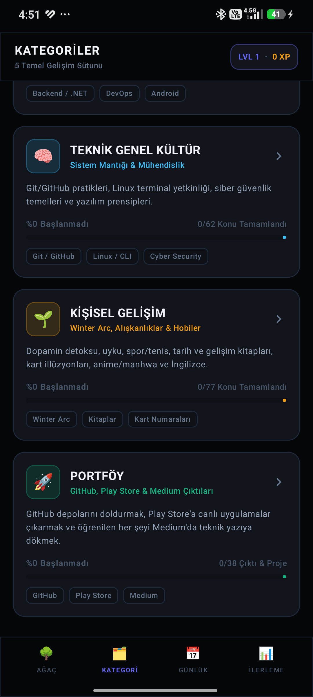
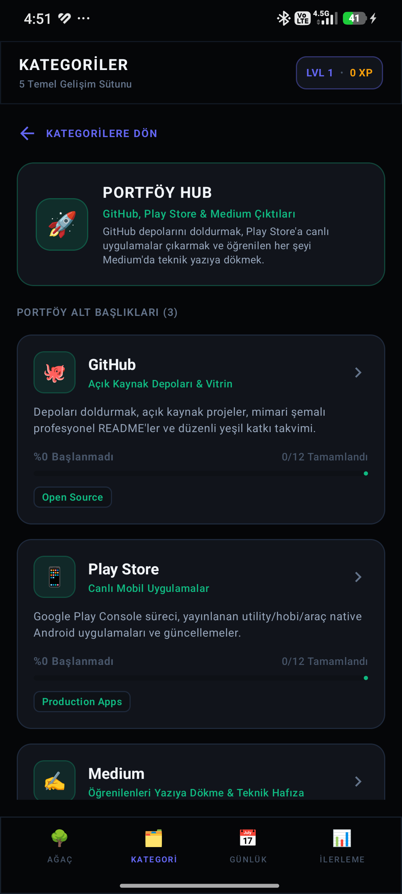
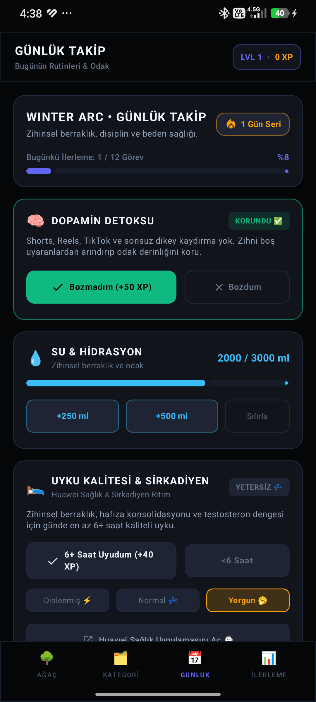
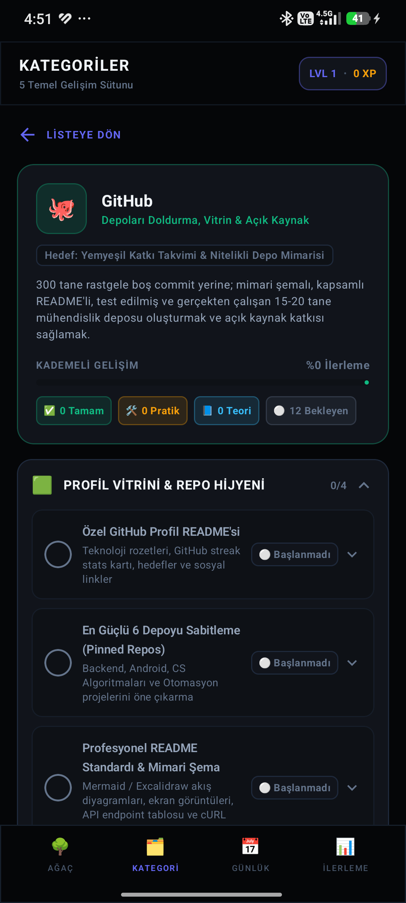
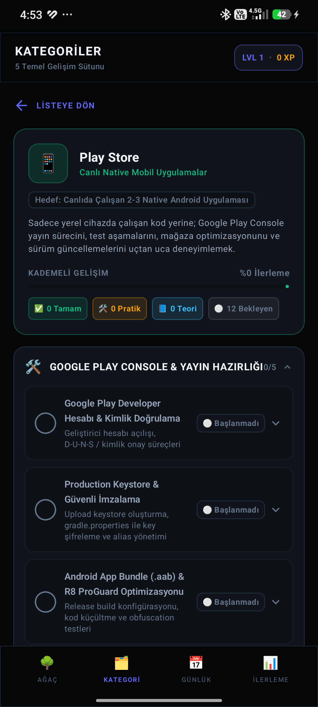
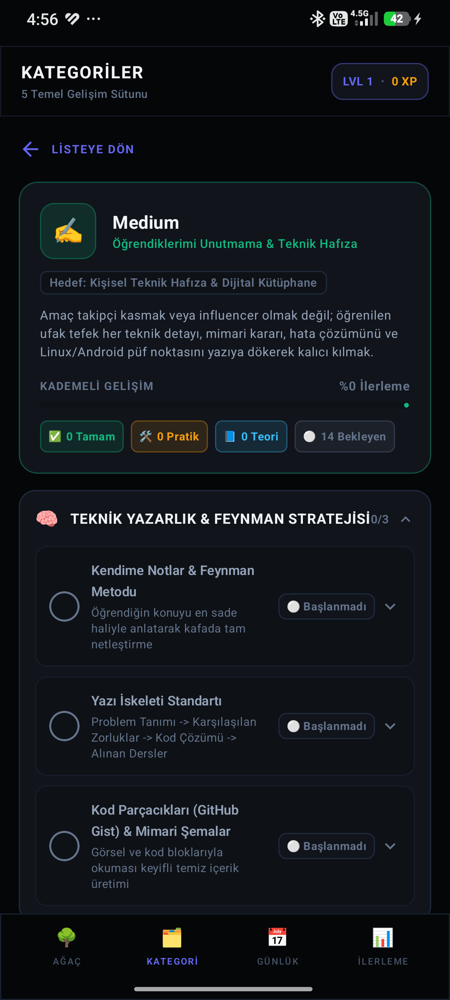

<div align="center">

# 🌲 Winter Arc Android
### Computer Engineering Skill Tree, Strategic Roadmaps & Daily Habit Tracker

*Bilgisayar Mühendisliği akademik müfredatını, kurumsal backend mimarisini, teknik genel kültürü, disiplinli Winter Arc alışkanlıklarını ve gerçek dünya portföy çıktılarını tek bir merkezde birleştiren modern Android uygulaması.*

<br/>

[-3DDC84?logo=android&logoColor=white)](#)
[](#)
[](#)
[](#)
[](#)
[](#)

</div>

---

## 📌 Proje Hakkında

**Winter Arc Android**, bir bilgisayar mühendisinin üniversite döneminden mezuniyete ve profesyonel kariyerine uzanan tüm gelişim adımlarını somut, ölçülebilir ve motive edici bir sistemle takip etmesi için sıfırdan geliştirilmiştir.

Uygulama; klasik to-do listeleri yerine **RPG tarzı kademeli yetenek ağacı (Skill Tree)**, **5 ana gelişim sütunu**, **dinamik yüzdelik ilerleme motoru** ve **offline-first çalışan günlük alışkanlık takipçisi** sunar.

---

## 🏛️ 5 Temel Gelişim Sütunu (Core Pillars)

Uygulama tüm mühendislik ve kişisel yolculuğu 5 ana kategori altında organize eder:

```mermaid
graph TD
    Root["🌲 Winter Arc Master Engine"] --> Col1["🎓 OKUL<br/>Akademik & CS"]
    Root --> Col2["💼 KARİYER<br/>Sektör Odaklı Uzmanlık"]
    Root --> Col3["🧠 TEKNİK GENEL KÜLTÜR<br/>Mühendislik Temelleri"]
    Root --> Col4["🌱 KİŞİSEL GELİŞİM<br/>Winter Arc & Rutinler"]
    Root --> Col5["🚀 PORTFÖY<br/>Somut Çıktılar"]

    Col1 --> C1_1["Mühendislik Dersleri"]
    Col1 --> C1_2["Veri Yapıları & Algoritmalar"]
    Col1 --> C1_3["Bitirme Tezi (LLM KV Cache)"]
    Col1 --> C1_4["CS Başucu Kitapları"]

    Col2 --> C2_1[".NET 8/9 Clean Architecture"]
    Col2 --> C2_2["Dağıtık Sistemler & DevOps"]
    Col2 --> C2_3["Native Android (Compose)"]
    Col2 --> C2_4["Kişisel Proje Kanbana'sı"]
    Col2 --> C2_5["BTK Akademi Diplomaları"]

    Col3 --> C3_1["Git & GitHub İleri Seviye"]
    Col3 --> C3_2["Linux Terminal & Shell Scripting"]
    Col3 --> C3_3["Siber Güvenlik Temelleri"]
    Col3 --> C3_4["Yazılım Mühendisliği İlkeleri"]

    Col4 --> C4_1["Dopamin Detoksu & Streak"]
    Col4 --> C4_2["Uyku Düzeni (6+ Saat)"]
    Col4 --> C4_3["Su & Beslenme Takibi"]
    Col4 --> C4_4["Spor & Tenis"]
    Col4 --> C4_5["Kitaplar & Hobiler (Kart/Anime)"]

    Col5 --> C5_1["🐙 GitHub (Depoları Doldurma)"]
    Col5 --> C5_2["📱 Play Store (Canlı Uygulamalar)"]
    Col5 --> C5_3["✍️ Medium (Teknik Hafıza)"]
```



---

## ✨ Öne Çıkan Özellikler

### 1. 🐙 📱 ✍️ Odaklanmış Portföy Motoru
- **GitHub**: Rastgele depolar yerine mimari şemalı, profesyonel README'li, test edilmiş 15-20 nitelikli mühendislik deposu, yeşil commit takvimi ve open-source PR hedefleri.
- **Play Store**: Google Play Console yayın süreci, Keystore güvenliği, AAB/R8 optimizasyonu, 20 test kullanıcılı kapalı test ve mağazada canlı uygulamalar (*Winter Arc, Kelime Takipçisi, Niş Araçlar*).
- **Medium**: Öğrenilen ufak tefek her teknik bilgiyi (*Global Exception Handling, JWT Refresh, EF Core AsNoTracking, Jetpack Compose Recomposition, Linux trikleri*) kişisel teknik hafızaya ve makaleye dönüştürme.

### 2. 🔥 Winter Arc Günlük Rutin Takipçisi
- **Dopamin Detoksu**: Bozulmayan gün serisi (Streak) sayacı, pratik `Bozdum / Bozmadım` butonları ve haptic geri bildirim.
- **Uyku Disiplini**: 6+ saat kaliteli uyku kontrolü.
- **Su Takibi**: 2000ml hedefli dinamik bardak ekleme motoru.
- **Tarih Filtreli Alışkanlıklar**: Geçmiş günlerin kayıtlarını inceleme ve anlık güncelleme.

### 3. 📊 Kademeli Gelişim & Dinamik İlerleme Motoru
- Her konu 4 kademeli durumdan geçer: `Başlanmadı (%0)` ➔ `Teori (%25)` ➔ `Pratik (%75)` ➔ `Bitti (%100)`.
- Kategori ve alt başlık ilerleme yüzdeleri hiçbir sabit değer kullanılmadan **tamamen dinamik formülle** anlık hesaplanır.

### 4. 📳 Haptic Engine & Modern UI
- Özel olarak tasarlanmış `HapticEngine` ile buton tıklamaları, aşama ilerlemeleri ve tamamlama aksiyonlarında gerçekçi dokunsal titreşimler.
- Dark Void teması, neon aksan renkleri, glassmorphism kart efektleri ve Material 3 bileşenleri.

---

## 📸 Ekran Görüntüleri

<div align="center">

| 5 Temel Gelişim Sütunu | Portföy Çıktıları Hub | Günlük Winter Arc Takipçisi |
| :---: | :---: | :---: |
|  |  |  |

| GitHub Yol Haritası | Play Store Yayın Süreci | Medium Teknik Hafıza |
| :---: | :---: | :---: |
|  |  |  |

</div>

---

## 🛠️ Teknoloji Yığını & Mimari

- **Dil**: Kotlin 2.0+
- **Kullanıcı Arayüzü**: Jetpack Compose, Material 3, Compose Navigation
- **Mimari**: Model-View-ViewModel (MVVM), Single Activity, Unidirectional Data Flow (UDF)
- **Yerel Veri Saklama**: AndroidX Room SQLite Database, SharedPreferences (Offline-first)
- **Asenkron Yapı**: Kotlin Coroutines, StateFlow
- **Geri Bildirim**: Android VibrationEffect / Haptic Feedback Engine
- **Derleme Aracı**: Gradle Kotlin DSL (`build.gradle.kts`), KSP (Kotlin Symbol Processing)

---

## 📁 Proje Dizin Yapısı

```text
Winter-Arc-Android/
├── app/
│   ├── src/main/
│   │   ├── java/com/example/
│   │   │   ├── MainActivity.kt                      # Ana giriş aktivitesi ve navigasyon
│   │   │   ├── data/
│   │   │   │   ├── db/                              # Room veritabanı, Entity & DAO'lar
│   │   │   │   │   ├── AppDatabase.kt
│   │   │   │   │   └── DailyHabitDao.kt
│   │   │   │   └── model/                           # Yol haritası veri modelleri
│   │   │   │       ├── RoadmapTopics.kt             # Okul, Kariyer, Kültür, Gelişim, Portföy konuları
│   │   │   │       ├── RoadmapProgressHelper.kt     # Dinamik yüzde hesaplama motoru
│   │   │   │       └── Models.kt                    # SkillNode, Project modelleri
│   │   │   ├── ui/
│   │   │   │   ├── components/                      # Ekranlar ve UI bileşenleri
│   │   │   │   │   ├── CategoriesDashboardView.kt   # 5 ana sütun paneli
│   │   │   │   │   ├── CategorySubItemsHubView.kt   # Kategori içi alt başlık hub'ı
│   │   │   │   │   ├── SubItemChecklistView.kt      # Detaylı konu kontrol listesi
│   │   │   │   │   ├── DailyTrackerView.kt          # Winter Arc alışkanlık takipçisi
│   │   │   │   │   └── SkillTreeGraphView.kt        # Yetenek ağacı grafiği
│   │   │   │   ├── theme/                           # Dark Void renk paleti & tipografi
│   │   │   │   └── util/
│   │   │   │       └── HapticEngine.kt              # Dokunsal titreşim motoru
│   │   └── res/                                     # Drawable, mipmap ve XML varlıkları
├── docs/
│   └── screenshots/                                 # Dokümantasyon ekran görüntüleri
├── WinterArc-v1.0.apk                                # Telefona doğrudan kurulabilir APK
├── build.gradle.kts                                 # Üst düzey build yapılandırması
└── README.md                                        # Proje tanıtım ve rehber dokümanı
```

---

## 🚀 Kurulum ve Çalıştırma

### Gereksinimler
- Android Studio Ladybug (2024.2+) veya daha yenisi
- JDK 17+
- Android SDK 34+ (Android 14)
- Minimum Cihaz Sürümü: Android 8.0 (API Level 26)

### 1. Depoyu Klonlayın
```bash
git clone https://github.com/ozdilinanc/Winter-Arc-Android.git
cd Winter-Arc-Android
```

### 2. APK Derleme
Projeyi doğrudan terminalden derlemek için:

```bash
# Debug APK üretimi
./gradlew assembleDebug

# Üretilen APK yolu:
# app/build/outputs/apk/debug/app-debug.apk
```

### 3. Cihaza Yükleme (ADB)
Bağlı olan Android cihazınıza veya emülatörünüze tek komutla kurun:

```bash
adb install -r WinterArc-v1.0.apk
# veya
adb install -r app/build/outputs/apk/debug/app-debug.apk
```

---

## 📦 APK İndirme & Paylaşım

Arkadaşlarınızla paylaşmak veya telefonunuza WhatsApp / Telegram üzerinden atıp doğrudan kurmak için projenin ana dizinindeki hazır APK dosyasını kullanabilirsiniz:

* **Dosya Adı**: `WinterArc-v1.0.apk`
* **Boyut**: ~23 MB
* **Kurulum**: Android telefonunuzda dosyaya tıklayın ve *"Bilinmeyen kaynaklardan yüklemeye izin ver"* seçeneğini onaylayarak saniyeler içinde kurun.

> **Not (APK vs AAB):** 
> - **APK (.apk)**: Doğrudan telefonlara WhatsApp, Drive veya kablo ile atılıp yüklenebilen pakettir.
> - **AAB (.aab)**: Yalnızca Google Play Console'a uygulama yayınlarken yüklenen geliştirici paketidir; telefonlar tarafından doğrudan kurulamaz.

---

## 📜 Lisans

Bu proje [MIT Lisansı](LICENSE) kapsamında lisanslanmıştır. Dilediğiniz gibi inceleyebilir, çatallayabilir (fork) ve kendi Winter Arc hedefleriniz için özelleştirebilirsiniz.

---

<div align="center">
  Geliştirici: <strong>İnanç Özdil</strong> • 2026
</div>
